# Récit visuel : de la donnée brute au modèle

Ce document est le fil conducteur des 18 visualisations du projet. Chacune répond à une
question posée avant de la tracer, et chaque titre de section énonce **ce que la figure
montre**, pas ce qu'elle représente. Les figures sont produites par les notebooks des
étapes 2, 4, 5, 5b, 5c et 6 ; aucun chiffre n'est saisi à la main ici.

La question à laquelle tout ce qui suit se rapporte : **peut-on prédire le taux d'emploi
salarié d'une formation six mois après le diplôme, à partir de ses seules
caractéristiques ?**

| Acte | Question | Figures |
|---|---|---|
| 1 | Ces données sont-elles exploitables ? | 1 à 3 |
| 2 | Qu'est-ce qui sépare une formation qui insère d'une autre ? | 4 à 6, 11 |
| 3 | Deux résultats qui contredisent l'intuition | 7, 9 |
| 4 | Que faut-il refuser de donner au modèle ? | 8, 10 |
| 5 | Que vaut le modèle, et où échoue-t-il ? | 12 à 16, 18 |

---

## La figure à retenir si on n'en retient qu'une

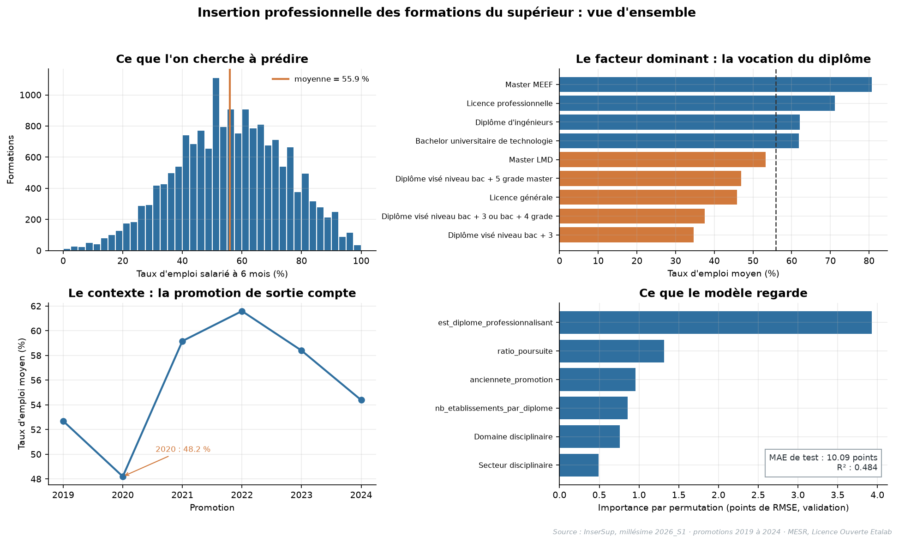

Quatre panneaux, un par étape du raisonnement : l'objet à prédire, le facteur qui sépare le
plus, le contexte temporel, et ce que le modèle en retient.

La correspondance entre les panneaux (b) et (d) est le point à voir : le facteur que
l'analyse exploratoire avait identifié comme dominant, la vocation du diplôme, est aussi
celui que le modèle utilise le plus. L'analyse et le modèle racontent la même histoire.

Les dix-sept figures qui suivent développent ces quatre panneaux dans l'ordre du raisonnement.

---

## Acte 1 : ces données sont-elles exploitables ?

### 1. Le jeu de modélisation est complet, sauf sur deux colonnes qui ne seront pas utilisées

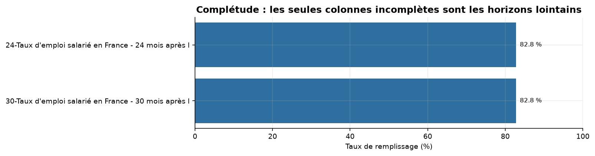

21 colonnes sur 23 sont remplies à 100 %. Les deux exceptions sont les taux d'emploi à 24
et 30 mois, à 82,76 %, soit 2 942 valeurs manquantes chacune. La cible, elle, est complète
sur les 17 065 formations.

Ce trou n'est pas un hasard, et la figure suivante dit pourquoi.

### 2. Les valeurs manquantes portent une seule promotion : 2024 n'a pas encore atteint l'horizon

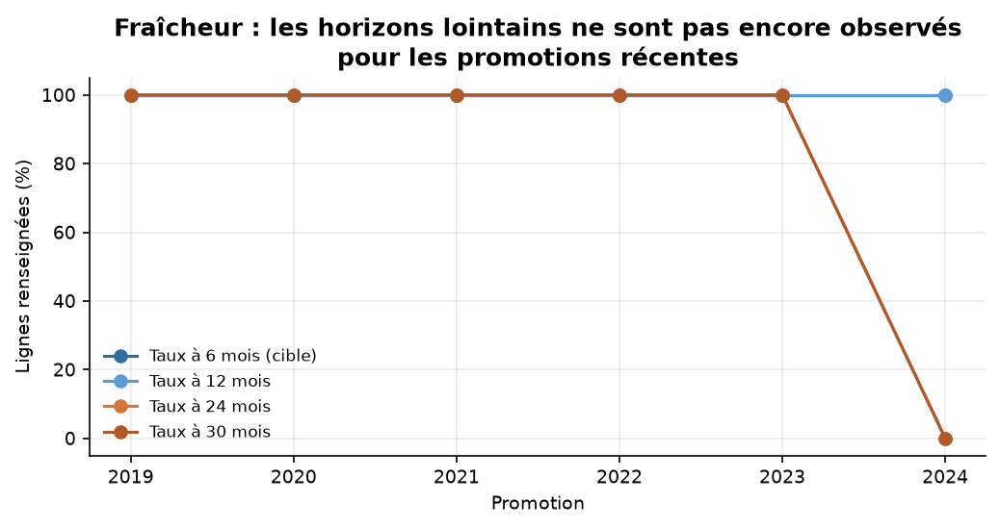

Les promotions 2019 à 2023 sont renseignées à 100 % sur tous les horizons. La promotion
2024 est à 0 % sur 24 et 30 mois : au moment de la diffusion du millésime, ses diplômés ne
sont pas sortis depuis assez longtemps. Ses 2 942 lignes correspondent **exactement** aux
2 942 manquants de la figure précédente.

Diagnostic tranché : ce n'est pas un défaut de collecte, c'est le temps qui n'a pas passé.
Imputer ces valeurs reviendrait à inventer un futur non observé. Elles sont écartées.

### 3. La cible est unimodale et centrée : une régression est le bon cadre

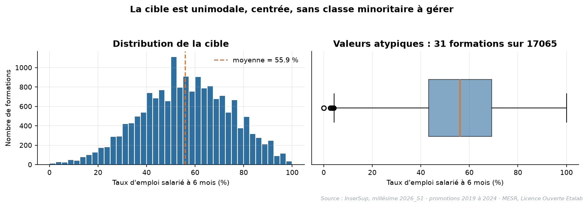

Moyenne 55,9, médiane 56,1, écart-type 18,5, étendue de 0 à 100. Pas de second mode, pas de
classe minoritaire à gérer, pas de transformation nécessaire.

L'écart-type de 18,5 est le repère à garder en tête : il donne la mesure de ce qu'un
modèle doit battre. Prédire la moyenne pour tout le monde coûte environ 15 points d'erreur
absolue moyenne.

---

## Acte 2 : qu'est-ce qui sépare une formation qui insère d'une autre ?

### 4. La vocation du diplôme ouvre un écart de 46 points, soit 2,5 fois l'écart-type

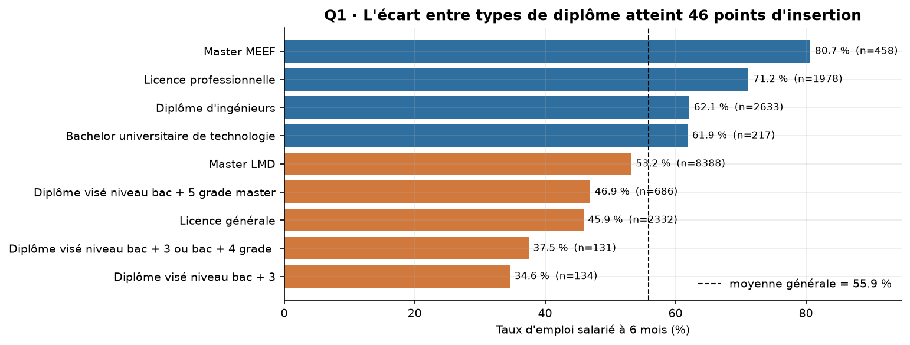

Du Master MEEF (80,68 % en moyenne) au diplôme visé de niveau bac + 3 (34,61 %), l'écart
est de 46,1 points. Le classement oppose deux logiques : en tête les diplômes qui mènent
directement à un métier, en queue ceux qui mènent à une poursuite d'études.

L'explication est en partie mécanique, et c'est important de le dire : un diplômé qui
poursuit ses études n'est pas en emploi salarié, donc il fait baisser le taux sans qu'aucun
échec d'insertion ne soit en cause.

### 5. Le secteur disciplinaire porte deux fois plus de signal que le domaine

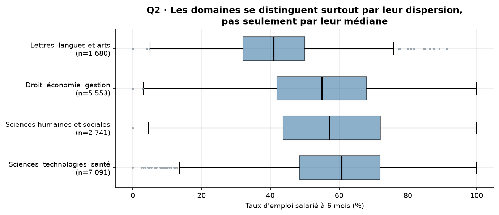

Entre les quatre domaines, l'écart est de 18,4 points, de Sciences et technologies (59,75)
à Lettres, langues et arts (41,38). Mais sur les 31 secteurs disciplinaires d'au moins
100 formations, l'amplitude atteint **37,2 points**, plus du double.

Conséquence directe, et c'est une décision de modélisation prise ici : agréger au niveau du
domaine écraserait la moitié du signal. Le modèle recevra le secteur.

### 6. Entre établissements, 41,6 points d'amplitude, mais l'effet se confond avec la discipline

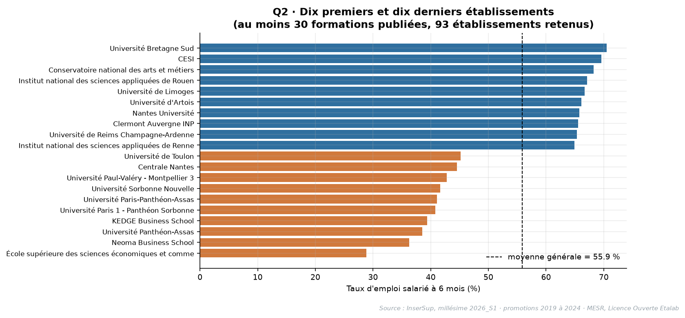

Sur les établissements d'au moins 30 formations publiées, les dix premiers et les dix
derniers sont séparés de 41,6 points, pour un écart-type des moyennes de 8,0 points.

Le piège de lecture est ici : un établissement spécialisé hérite de la performance de son
secteur. Cette figure ne classe pas les établissements par qualité, elle montre que leur
composition disciplinaire diffère. C'est pour cette raison que le nom de l'établissement
est exclu du modèle, au profit de variables dérivées.

### 7. Plus la formation est petite, plus la cible est bruitée

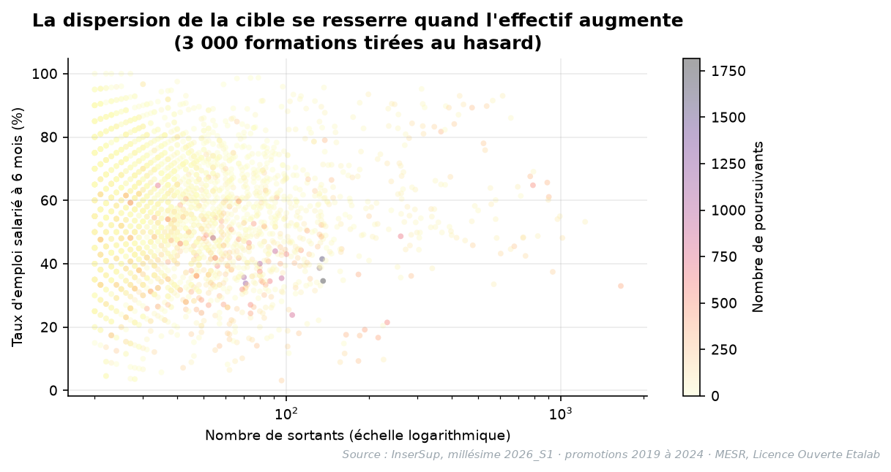

L'écart-type de la cible passe de 20,33 sur le premier quintile d'effectif à 17,13 sur le
quatrième. La moyenne, elle, bouge à peine : la corrélation entre le nombre de sortants et
le taux d'emploi n'est que de 0,017.

Autrement dit, l'effectif ne dit pas si une formation insère bien, il dit **avec quelle
précision on peut le mesurer**. Sur 20 diplômés, un seul individu vaut 5 points de taux.
Cette figure annonce l'hypothèse que l'étape 5c confirmera : l'erreur du modèle sera plus
forte sur les petites formations.

---

## Acte 3 : deux résultats qui contredisent l'intuition

### 8. L'écart entre femmes et hommes change de signe selon la façon de comparer

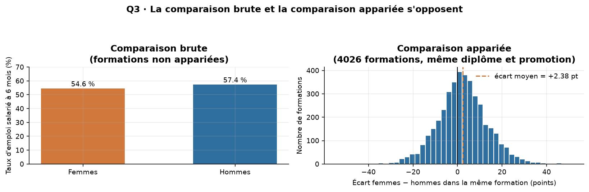

En comparaison brute, les hommes affichent 57,40 contre 54,57 pour les femmes, soit
2,84 points d'écart en leur faveur. En comparant les 4 026 formations où les deux sont
publiés, à diplôme, établissement et promotion identiques, le résultat s'inverse : 55,37
pour les femmes contre 52,99, soit **2,38 points en faveur des femmes**, qui sont mieux
insérées dans 58,8 % des formations comparées.

L'écart brut est un effet de composition : femmes et hommes ne se répartissent pas de la
même façon entre les disciplines, et les disciplines n'ont pas les mêmes débouchés. **La
comparaison brute mesure l'orientation, pas l'insertion.**

Limite à énoncer en même temps que le résultat : ces variables ne sont pas dans le jeu de
modélisation, le modèle ne dira donc rien sur ces disparités.

### 9. Le choc de 2020 frappe les quatre domaines en même temps

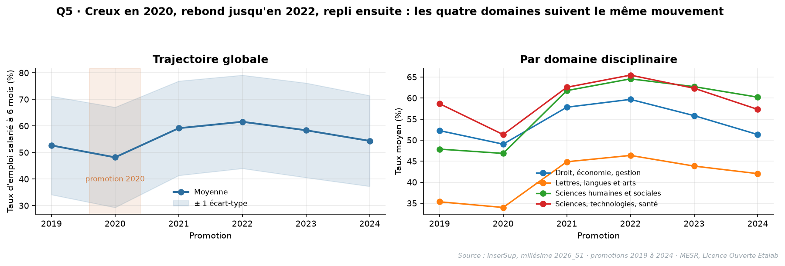

Amplitude de 13,4 points sur six promotions : creux à 48,20 en 2020, sommet à 61,60 en
2022, puis repli de 7,2 points jusqu'en 2024.

Le point qui compte n'est pas le creux lui-même, c'est sa **simultanéité**. Un mouvement
commun à des disciplines aussi différentes que les lettres et le génie civil ne s'explique
pas par les formations : il pointe vers le marché du travail au moment de la sortie.

D'où deux décisions opposées mais cohérentes : fournir la promotion au modèle, puisqu'elle
porte un effet de conjoncture réel, et accepter qu'il ne saura pas anticiper un choc
inédit. L'étape 5c chiffre ce coût.

---

## Acte 4 : que faut-il refuser de donner au modèle ?

### 10. Les variables les mieux corrélées à la cible sont précisément celles qu'il faut exclure

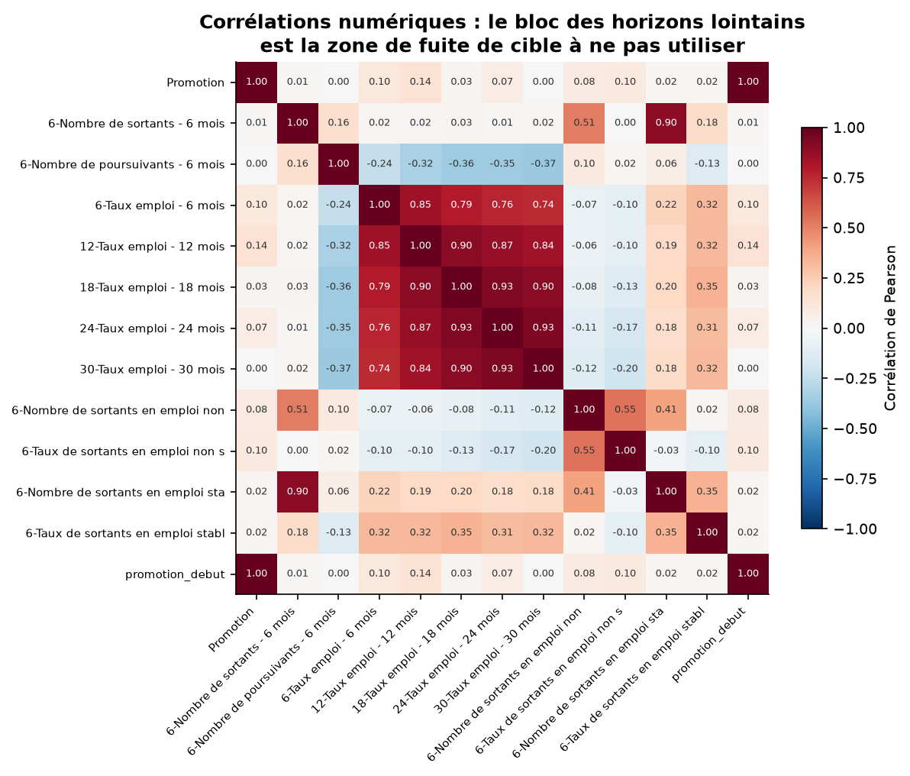

Le taux d'emploi à 12 mois corrèle à 0,849 avec la cible, celui à 18 mois à 0,794. Ce sont
les variables les plus prédictives du jeu, et elles sont **inutilisables** : elles sont
mesurées après l'horizon que le modèle doit prédire. Les donner reviendrait à prédire le
passé avec le futur.

Cette figure est la carte de la fuite de données. Les variables réellement exploitables
sont bien plus modestes : le nombre de poursuivants plafonne à -0,236, le nombre de
sortants à 0,017.

C'est la figure qui fixe le plafond de performance réaliste du projet, et qui explique
qu'un R carré autour de 0,5 soit un bon résultat ici, pas un échec.

### 11. Insertion et stabilité de l'emploi ne se recouvrent qu'à moitié

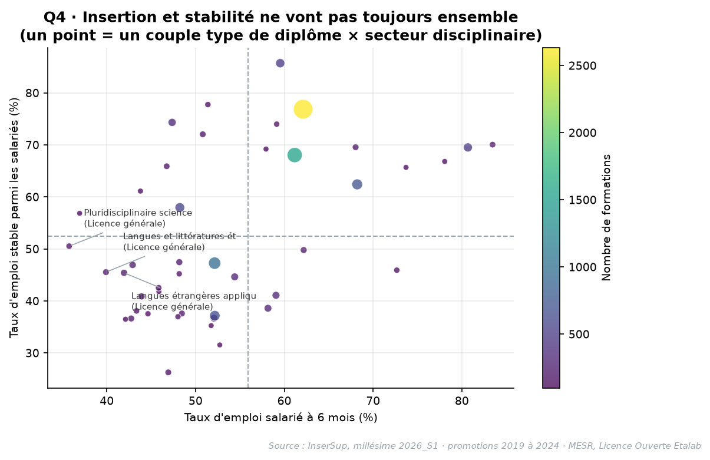

La corrélation entre taux d'emploi et taux d'emploi stable n'est que de 0,466. Sur les 44
couples type de diplôme × secteur disciplinaire d'au moins 100 formations, 22 sont sous les
deux moyennes à la fois.

Une formation peut donc insérer beaucoup et mal, ou peu et durablement. Master LMD ×
Histoire descend à 26,27 % d'emploi stable. Choisir une seule cible, comme ce projet le
fait, c'est accepter de ne raconter qu'une moitié de l'histoire, et il vaut mieux l'écrire
que le laisser découvrir.

---

## Acte 5 : que vaut le modèle, et où échoue-t-il ?

Toutes les figures de cet acte sont mesurées en **validation croisée groupée par
formation** : un modèle n'y est jamais évalué sur une promotion d'une formation dont il a vu
les autres. Le jeu de test, ouvert une seule fois à l'étape 5c, ne sert qu'au score final.

### 12. Le boosting se détache, et la référence naïve fixe le repère

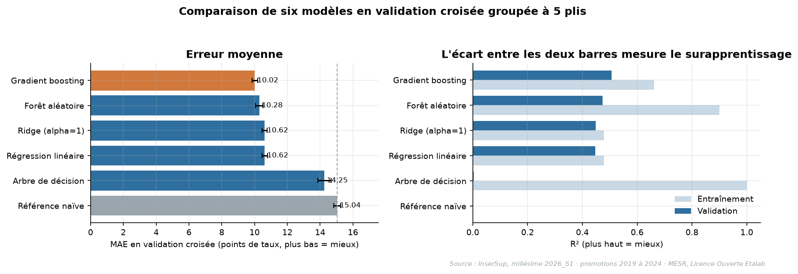

En validation croisée groupée à 5 plis : gradient boosting 10,02 de MAE, forêt aléatoire
10,28, régression linéaire et Ridge 10,62, arbre seul 14,25, référence naïve 15,05.

Le panneau de droite montre le surapprentissage. L'arbre de décision atteint un R carré
d'entraînement de 1,00 pour 0,004 en validation : sur des formations inconnues, il ne fait
presque pas mieux que la moyenne. La forêt garde un écart important (0,90 contre 0,47), le
boosting beaucoup moins (0,66 contre 0,51).

### 13. La grille de la forêt départage mal, et c'est une information

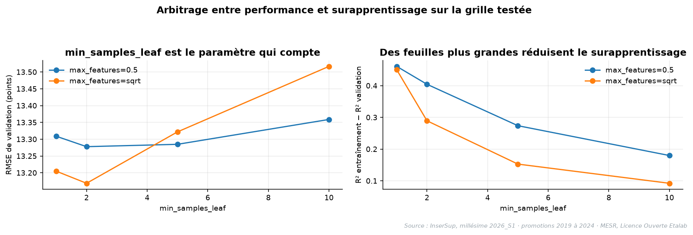

14 configurations sur 16 sont à moins d'un écart-type de la meilleure : en validation
groupée, la variabilité entre plis dépasse les écarts entre réglages. La règle à un
écart-type retient la plus simple (`min_samples_leaf=10`), pour 0,19 point de RMSE de plus
que la meilleure et un écart entraînement / validation ramené de 0,29 à **0,18**. Des
feuilles plus grandes réduisent le surapprentissage, et c'est ce que la figure montre.

### 14. Le modèle se trompe sans biais global, mais ramène les extrêmes vers la moyenne

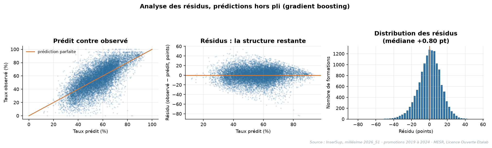

Résidus du gradient boosting retenu, sur des prédictions hors pli. Le résidu moyen est quasi
nul (+0,13 point), mais le nuage « prédit contre observé » est aplati : les formations qui
insèrent à 85 % ou plus sont sous-estimées de 15 points en moyenne, celles qui insèrent à
25 % ou moins surestimées de 23 points. Le modèle est le moins fiable exactement là où une
formation se distingue.

Sur le jeu de test, ouvert une seule fois : **10,09 points de MAE** contre 14,77 pour la
référence naïve, soit **32 % d'erreur en moins**, pour un R carré de 0,484. Ce score
rejoint à 0,006 point celui de la validation croisée groupée.

### 15. Le modèle s'appuie sur la vocation du diplôme, exactement comme l'EDA l'annonçait

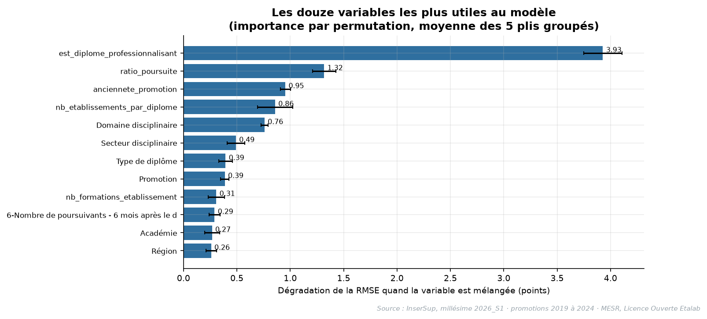

Par permutation, moyennée sur les cinq plis groupés : `est_diplome_professionnalisant`
dégrade la RMSE de 3,93 points quand on la mélange, `ratio_poursuite` de 1,32,
`anciennete_promotion` de 0,95, `nb_etablissements_par_diplome` de 0,86. Les quatre
premières sont des variables créées à l'étape 3.

Le ratio de poursuite confirme l'hypothèse 1 de l'étape 2. Mais l'hypothèse 2 est
**infirmée** : le secteur disciplinaire (0,49) ne prime pas sur le domaine (0,76), les deux
étant redondants. Le modèle sert aussi à cela, trancher des intuitions formées sur des
moyennes.

### 16. L'erreur est 1,6 fois plus forte sur les petites formations

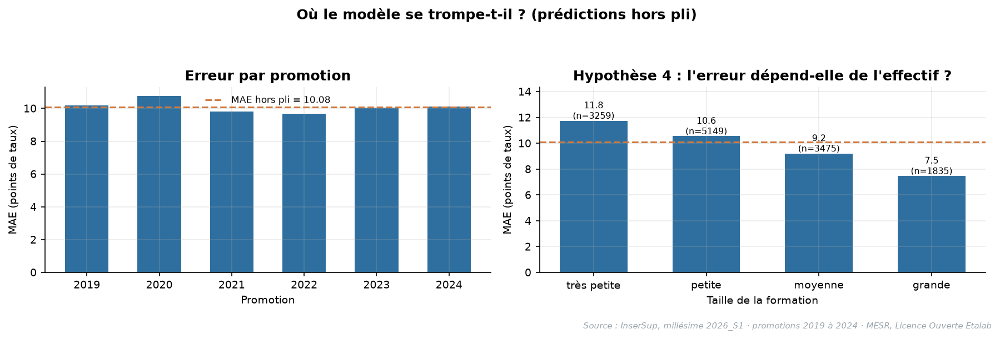

De 7,47 points de MAE sur les formations de plus de 90 sortants à **11,75 points** sur
celles de 25 sortants ou moins.

C'est la confirmation de l'hypothèse 4, et surtout la précision qui manque quand on annonce
« 10 points d'erreur » : cette moyenne recouvre des situations très différentes. La
promotion 2020 reste la plus difficile (10,75), faute pour le modèle de pouvoir représenter
un choc conjoncturel.

### 17. Le boosting gagne, mais les deux modèles prédisent presque la même chose

Une fois chacun optimisé sur sa propre grille, le gradient boosting l'emporte : 10,08 de MAE
contre 10,26 pour la forêt, sur les cinq plis et sur 13 des 14 découpages par groupe. C'est
lui qui est livré. Le nuage de droite montre pourtant que l'écart importe peu : leurs
prédictions corrèlent à 0,966 et ne divergent de plus de 10 points que sur 0,9 % des
lignes.

Le panneau de gauche explique cette proximité : ils s'appuient sur les mêmes variables, avec
des intensités différentes. Le boosting tire près de deux fois plus de
`est_diplome_professionnalisant`, mais il n'a pas trouvé un signal que la forêt aurait
manqué. Quand deux approches très différentes convergent sur les mêmes variables et les
mêmes prédictions, c'est que le signal est dans les données, pas dans l'algorithme.

---

## Le récit en cinq phrases

1. L'insertion se joue d'abord sur **ce qu'on étudie** : le secteur disciplinaire ouvre un
   écart deux fois plus large que le domaine.
2. Elle se joue ensuite sur **la vocation du diplôme** : les formations professionnalisantes
   insèrent nettement mieux, et c'est ce que le modèle utilise en premier.
3. Elle se joue enfin sur **le moment de la sortie** : la promotion 2020 paie la crise
   sanitaire dans les quatre domaines à la fois.
4. Deux lectures d'une même donnée peuvent s'opposer : l'écart entre femmes et hommes
   **change de signe** selon qu'on compare globalement ou à formation identique.
5. Les variables les plus corrélées à la cible sont celles qu'il faut **écarter**, et c'est
   ce qui fixe le plafond réaliste du modèle.

---

## Choix des figures pour la soutenance

Sept minutes ne permettent pas dix-huit figures. Les sept qui portent le récit complet :

| Ordre | Figure | Ce qu'elle prouve |
|---|---|---|
| 1 | `fig02_distribution_cible` | Le cadre : régression, cible centrée, repère de 18,5 points |
| 2 | `fig04_q1_type_diplome` | Le facteur dominant, 46 points d'écart |
| 3 | `fig09_q5_promotions` | L'effet conjoncturel, simultané sur quatre domaines |
| 4 | `fig10_correlations` | La fuite de données évitée, et le plafond réaliste |
| 5 | `fig12_comparaison_modeles` | Le modèle contre la référence naïve |
| 6 | `fig15_importance_variables` | Ce que le modèle a appris, et l'hypothèse infirmée |
| 7 | `fig16_erreurs_par_groupe` | Où le modèle échoue, annoncé avant la question |

`fig07_q3_genre` est la figure de réserve : c'est le résultat le plus frappant du projet, à
sortir si le temps le permet ou si le jury demande une découverte inattendue.

---

## Conventions graphiques

Toutes les figures partagent les mêmes règles, appliquées par un bloc `rcParams` commun aux
notebooks des étapes 2, 4, 5, 5b et 5c :

- **Titres porteurs de message.** Un titre énonce le constat, pas le contenu : « L'écart
  entre types de diplôme atteint 46 points d'insertion » plutôt que « Taux par type de
  diplôme ». Le lecteur qui ne regarde que les titres suit déjà le récit.
- **Palette** : bleu `#2f6f9f` pour la série principale, orange `#d1793c` pour l'élément
  mis en avant ou le groupe opposé, gris `#9aa5ad` pour les références et repères. Les
  variantes claires et sombres de ces trois teintes servent aux comparaisons à deux séries.
- **Axes** : toujours labellisés avec l'unité, points de taux d'emploi ou nombre de
  formations. **Aucun axe tronqué** : les échelles de taux partent de zéro, ce qui interdit
  d'exagérer un écart par le cadrage.
- **Repères** : une ligne de référence (moyenne générale, référence naïve) chaque fois
  qu'une valeur n'a de sens que comparée.
- **Cadres** : bordures haute et droite retirées, grille à 25 % d'opacité, titres en gras.
- **Aucune 3D, aucun camembert.** Les comparaisons de catégories passent par des barres
  horizontales triées, les distributions par histogramme et boîte à moustaches, les
  trajectoires par courbes avec intervalle.
- **Source et période** : apposées en pied de chaque figure exportée, par une fonction
  `annoter_source()` commune. Une figure finit toujours par circuler seule, détachée de son
  notebook : elle doit porter d'où viennent ses chiffres.
- **Export** : 150 ppp, cadrage serré, format PNG.

Ces règles sont vérifiables : `pie(` et `projection=` n'apparaissent nulle part dans les
notebooks, et les trois notebooks producteurs de figures partagent le même bloc de style.
