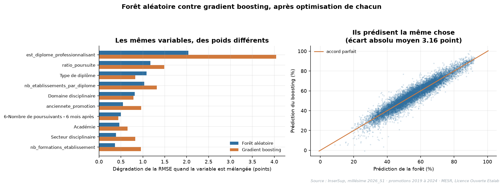

# Étape 5b - Duel : forêt aléatoire contre gradient boosting

## Objectif

L'étape 4 a laissé deux candidats : le gradient boosting devant la forêt aléatoire, 10,02
contre 10,28 de MAE en validation groupée, mais tous deux réglés par défaut. L'étape 5 a
optimisé la forêt sans la faire passer sous 10,1. Cette étape **choisit le modèle livré** :
elle optimise chacun avec sa propre grille, mesure ce qui les sépare, teste s'il vaut mieux
les combiner, et applique une règle de choix fixée avant le calcul.

Notebook : [`etape_5b_duel_foret_boosting.ipynb`](../notebooks/etape_5b_duel_foret_boosting.ipynb)

**Règle du jeu de test** : tout se joue en validation croisée groupée sur les seules
13 718 lignes d'apprentissage. Le jeu de test n'est pas construit : le modèle est choisi
avant qu'il soit ouvert, à l'étape 5c.

> **Révision du protocole** (voir [étape 10](étape_10_revision.md)). La première version de
> ce duel, en plis aléatoires, donnait déjà l'avantage au boosting (9,24 contre 9,44), mais
> conservait la forêt parce qu'elle seule avait un score de test. Avec un découpage groupé
> et un test neuf, cet argument disparaît : le vainqueur du duel est le modèle livré.

---

## 1. Dimensionner avant d'explorer

Trois plis groupés, pour une courbe de tendance.

| Famille | Paramètre | RMSE | Écart train − validation |
|---|---|---:|---:|
| Forêt | 50 arbres | 13,638 | 0,438 |
| Forêt | 100 arbres | 13,598 | 0,437 |
| Forêt | 200 arbres | 13,569 | 0,436 |
| Forêt | 400 arbres | 13,546 | 0,435 |
| Boosting | 100 itérations | 13,132 | 0,179 |
| Boosting | 200 itérations | 13,153 | 0,257 |
| Boosting | 400 itérations | 13,335 | 0,353 |
| Boosting | 800 itérations | 13,589 | **0,449** |

**La forêt plafonne.** Elle gagne l'essentiel avant 200 arbres, et son écart entraînement /
validation ne bouge pas : ajouter des arbres ne la fait pas surapprendre, cela stabilise
seulement la moyenne. Le nombre d'arbres est un budget de calcul, pas un levier.

**Le boosting surapprend vite.** Avec son pas par défaut, sa RMSE remonte dès 200
itérations et son écart entraînement / validation est multiplié par 2,5 de 100 à 800. Ses
vrais leviers sont le pas d'apprentissage et la taille des arbres.

---

## 2. Deux grilles, un protocole de sélection identique

| Forêt aléatoire | Valeurs explorées |
|---|---|
| `max_features` | `sqrt`, 0.3, 0.5, 0.8 |
| `min_samples_leaf` | 1, 2, 5, 10 |
| `n_estimators` | 300, fixé d'après la courbe ci-dessus |

| Gradient boosting | Valeurs explorées |
|---|---|
| `learning_rate` | 0.03, 0.06, 0.1 |
| `max_leaf_nodes` | 15, 31, 63 |
| `min_samples_leaf` | 10, 20 |
| `max_iter` | 400 |

Même sélection pour les deux : meilleure RMSE, puis **règle à un écart-type**, puis la
configuration la plus simple parmi les équivalentes.

| | Meilleure de la grille | Seuil à 1 écart-type | Équivalentes | Retenue |
|---|---:|---:|---:|---|
| Forêt | 13,175 (± 0,301) | 13,476 | 15 sur 16 | `max_features=0.3`, `min_samples_leaf=10` |
| Boosting | 12,950 (± 0,338) | 13,288 | 16 sur 18 | `learning_rate=0.03`, `max_leaf_nodes=15`, `min_samples_leaf=20` |

En validation groupée, la variabilité entre plis est plus forte que les écarts entre
réglages : presque toutes les configurations sont équivalentes, et la règle retient la plus
simple de chaque famille.

---

## 3. La règle de choix, fixée avant de lire les résultats

> Le modèle livré est celui des deux dont la MAE hors pli est la plus faible. La moyenne
> des deux n'est retenue que si elle bat le meilleur des deux de plus d'un écart-type entre
> plis.

## 4. Le résultat : le boosting gagne, partout

Prédictions hors pli, plis groupés : chaque ligne est prédite par un modèle qui n'a vu
aucune promotion de sa formation.

| Modèle | MAE | RMSE | R² | à ±5 pts | ratées de +15 pts |
|---|---:|---:|---:|---:|---:|
| Forêt optimisée | 10,261 | 13,346 | 0,481 | 32,3 % | 23,4 % |
| **Boosting optimisé** | **10,084** | **13,097** | **0,500** | 32,6 % | 22,8 % |
| Moyenne des deux | 10,085 | 13,119 | 0,499 | 32,4 % | 22,7 % |

**L'avantage du boosting est modeste mais systématique.** 0,178 point de MAE, soit 1,2
écart-type entre plis : pris isolément, l'écart serait discutable. Ce qui lui donne du
poids, c'est sa régularité : le boosting gagne **les cinq plis**, et **13 des 14
découpages** par taille de formation, domaine et promotion. La forêt ne garde que Lettres,
langues et arts, pour 0,03 point.

**Les deux modèles se ressemblent énormément.** Leurs prédictions corrèlent à **0,966**,
pour un écart absolu moyen de **2,5 points** ; elles ne divergent de plus de 10 points que
sur **0,9 %** des lignes ; leurs rangs d'importance corrèlent à **0,897**.

**Les combiner n'apporte rien.** La moyenne des deux fait exactement le score du boosting
seul (10,085 contre 10,084). Deux modèles qui se trompent aux mêmes endroits ne se
corrigent pas l'un l'autre.

**Ils exploitent le même signal, plus ou moins fort.** Le boosting s'appuie près de deux
fois plus sur `est_diplome_professionnalisant` (3,96 contre 2,19 points de RMSE) ; la forêt
pèse davantage sur le type de diplôme, qui porte en partie la même information.



---

## 5. Décision : le gradient boosting est retenu

La règle de la section 3 désigne le boosting, et la moyenne des deux ne la bat pas. Le
choix est enregistré dans `modeles/choix_modele.json`, **avant toute ouverture du jeu de
test** :

```json
{"modele": "Gradient boosting", "classe": "HistGradientBoostingRegressor",
 "parametres": {"max_iter": 400, "early_stopping": false, "learning_rate": 0.03,
                "max_leaf_nodes": 15, "min_samples_leaf": 20}}
```

### Ce que l'optimisation a apporté, et ce qu'elle n'a pas apporté

Elle n'a pas fait baisser l'erreur. La forêt passe de 10,283 (étape 4) à 10,261, le
boosting de 10,017 avec ses réglages par défaut à 10,084 avec la configuration retenue. Ces
écarts sont tous inférieurs à l'écart-type entre plis : la règle à un écart-type a retenu
la configuration la plus simple, pas la plus flatteuse en apparence.

Ce qu'elle a apporté, c'est la **garantie que le classement tient** : le boosting devançait
la forêt réglée par défaut, il devance aussi la forêt optimisée, et sur tous les plis.
Comparer deux modèles non optimisés ne dit rien de leur potentiel ; ici, l'optimisation
confirme le classement au lieu de l'inverser.

---

## Checklist

- [x] Chaque famille optimisée avec sa propre grille, sur ses vrais leviers
- [x] Nombre d'arbres et d'itérations dimensionnés avant l'exploration
- [x] Même protocole de sélection pour les deux, règle à un écart-type comprise
- [x] Comparaison sur les mêmes plis groupés, avec la même pipeline
- [x] Écart mesuré contre le bruit entre plis, pas commenté en valeur absolue
- [x] Analyse par groupe : qui gagne où, et sur combien de lignes
- [x] Piste de l'ensemble testée et rejetée sur preuve, pas par principe
- [x] Importances comparées entre les deux familles, sur un sous-découpage groupé
- [x] Règle de choix fixée avant le calcul, choix enregistré avant l'ouverture du test
- [x] Jeu de test non construit

---

## Utilisation de l'IA sur cette étape

| Prompt utilisé | Ce que l'IA a produit | Vérification effectuée |
|---|---|---|
| « Quels hyperparamètres comptent vraiment pour une forêt, pour un boosting ? » | `max_features` et `min_samples_leaf` d'un côté, `learning_rate` et `max_leaf_nodes` de l'autre | Vérifié par la courbe de convergence avant de bâtir les grilles : le nombre d'arbres ne discrimine effectivement plus au-delà de 200 |
| « Faut-il combiner deux modèles proches ? » | Réponse générale favorable au moyennage | Testée plutôt que crue : la moyenne fait exactement le score du boosting seul, parce que les deux modèles corrèlent à 0,966. La proposition ne tenait pas ici |
| « Comment savoir si un écart de MAE est significatif ? » | Comparaison à l'écart-type entre plis | Complétée par le décompte des plis gagnés et une analyse en 14 groupes : c'est la régularité de l'avantage, pas sa taille, qui a emporté la conclusion |

Le deuxième échange est le plus instructif : une recommandation correcte en général s'est
révélée fausse dans ce cas précis, et seule la mesure permettait de le voir.

**Révision.** La version corrigée du duel, en plis groupés et avec une règle de choix fixée
avant le calcul, a été menée avec Claude Code à partir des retours de la formatrice.
